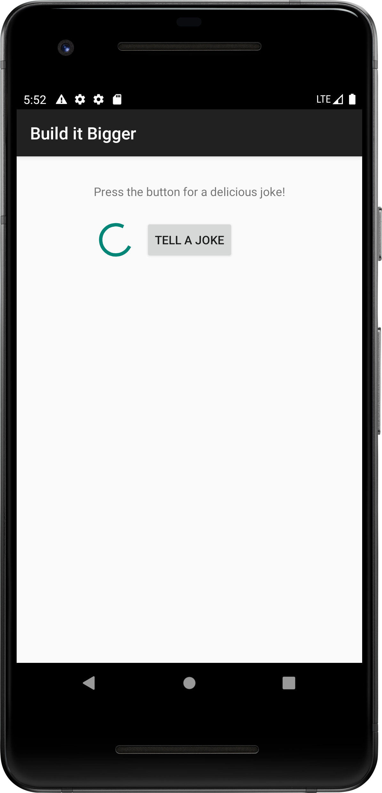
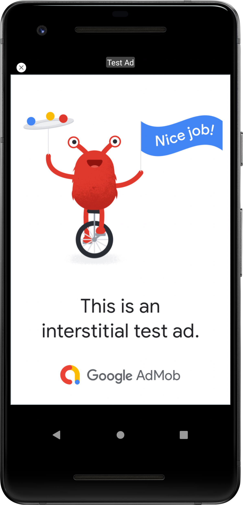
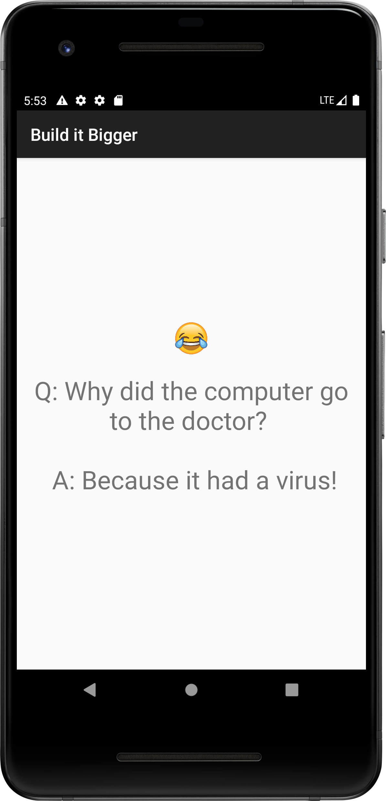

# Joke_Teller

App project for Udacity Android Developer Nanodegree course  

## Overview
* Joke telling app with multiple flavours and libraries
* App consists of four modules: 
   + A Java library that provides jokes
   + A Google Cloud Endpoints (GCE) project that serves those jokes
   + An Android Library containing an activity for displaying jokes
   + An Android app that fetches jokes from the GCE module and passes them to the Android Library for display
* App retrieves jokes from Google Cloud Endpoints module and displays them via an Activity from the Android Library, GCE module is deployed locally.
* Project contains paid/free flavors. The free flavour shows interstitial ad before showing a joke. The paid flavor has no ads and no unnecessary dependencies.
* Custom Gradle task to start the GCE dev server, run all the Android tests, and shut down the dev server.

 

 <video width="320" height="240" controls>
  <source src="jokes.mp4" type="video/mp4">
</video>  
   

 
 
 
